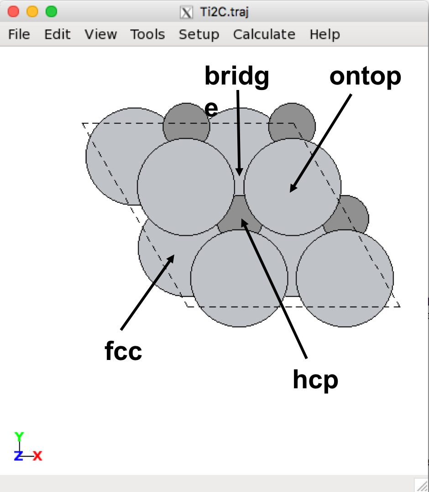

# ASE Tutorials
1. [Introduction to ASE](../)
2. [Getting Started](../Getting_Started/)
3. [Adsorption](../Adsorption/)

____

## Adsorption on MXenes ##

In the second exercise, you will be calculating the adsorption of N atoms on the Ti2C surface. The adsorption energy is defined as:

$$
\Delta E_\mathrm{ads} = E_\mathrm{surface + N*}  - E_\mathrm{surface} - E_\mathrm{N}
$$

where N* refers to adsorbed N. We have *E*surface from the previous exercise, so we will need to calculate *E*surface + N*. The energy of EN is -278.275 eV (we will talk about where this energy came from in the final project).

### Adsorption Sites ###

Take a look [here](http://CBE544.github.io/ASE/#ase-gui) if you need a reminder on how to add atoms using `ase-gui`. We will describe how to add atoms within the ASE script below.

First, open the .traj file with the optimized lattice constant that you obtained from the previous exercise. On the menu bar, select View -> Repeat. Under 'Repeat Atoms', change the first two numbers from 1 to 2; leave the third number as 1. Then, click set unit cell. Your cell should look like this:

 
2 x 2 surface of Ti2C

There are four possible adsorption sites on MXene surfaces that an adsorbate can bind to: the fcc, hcp, ontop, and bridge sites. These are illustrated below:

 
2 x 2 surface of Ti2C

In the `ase-gui`, click the atom above where the adsorbate will sit, press `Ctrl + A`, then specify the adsorbate and the vertical distance above the site. You can also hold `Ctrl` to select multiple atoms and add an adsorbate, which will be at the center of all the selected atoms. You can move the atoms by selecting the atom(s) you wish to move, press `Ctrl + M`, and use the arrow keys to move the atom(s); press `Ctrl + M` again to deselect the atom(s) for moving. In the following figure, we illustrate the placement of N on the ontop site:

 
ontop N2C

To relax these atoms, use the `Relax.py`script. In the output, there will be three columns: 

**HW 5:** Using the `Relax.py` script, calculate the Eads for N in each of the four stable sites. Note: All sites may not be stable (the adsorbed N may move to a different site). List each Eads, and say which is the most stable site.
